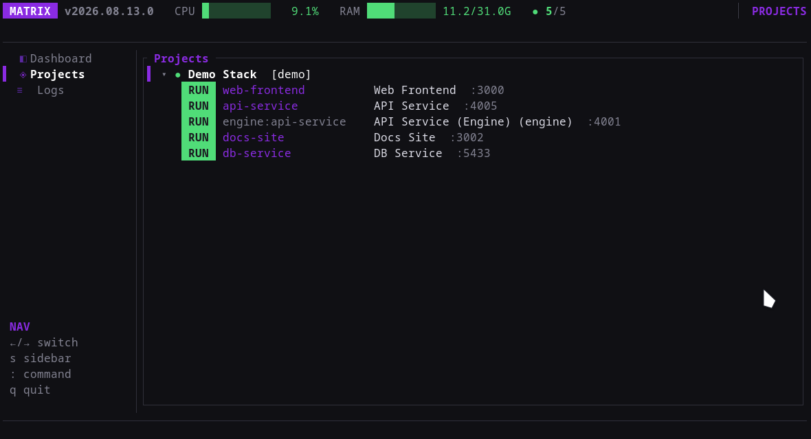
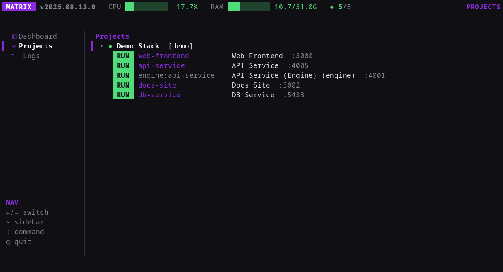
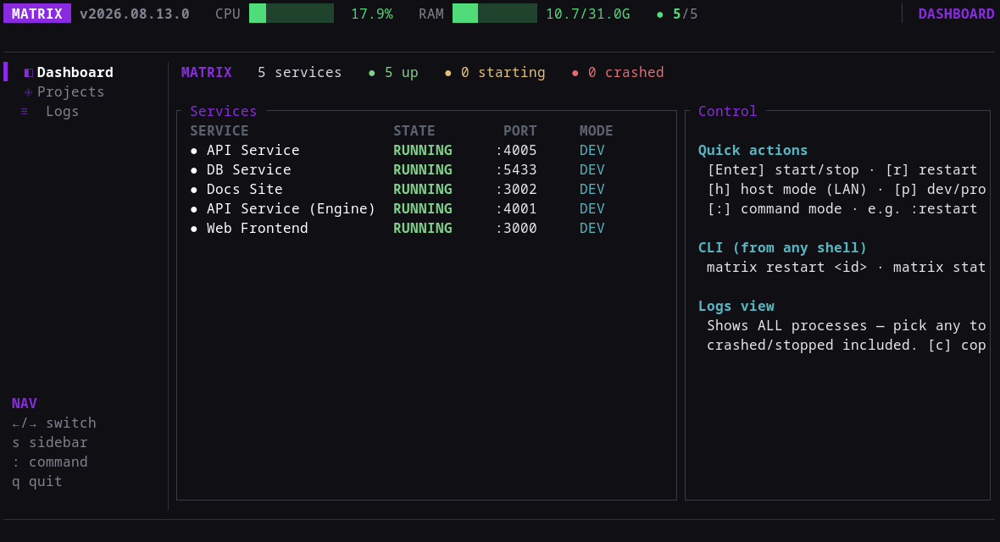
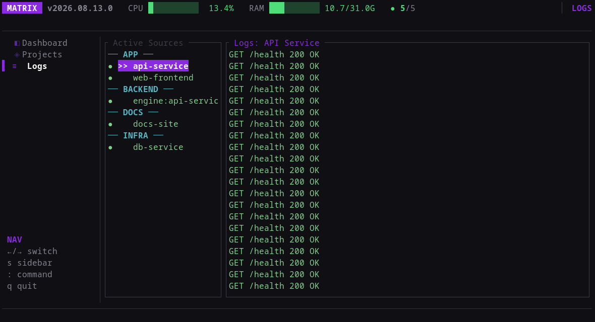
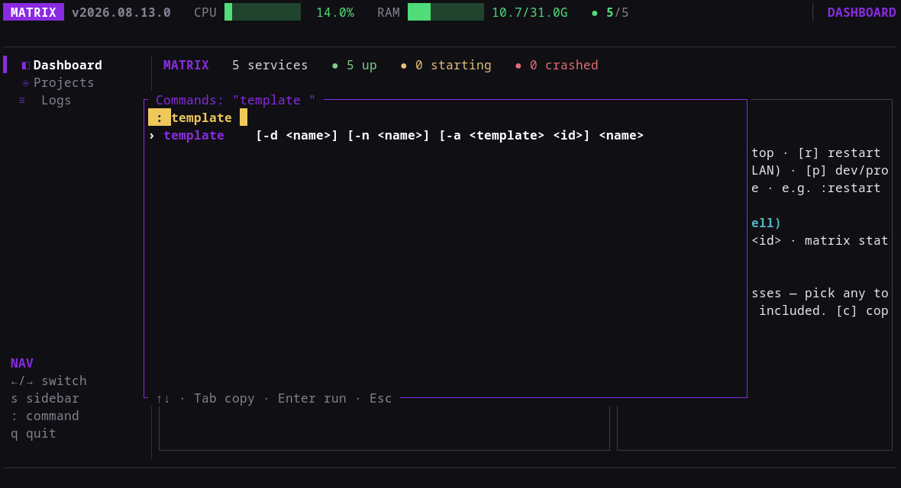
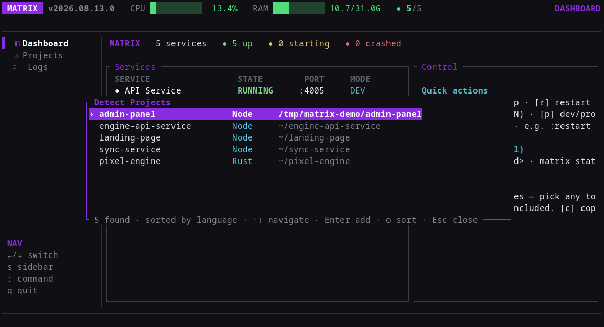
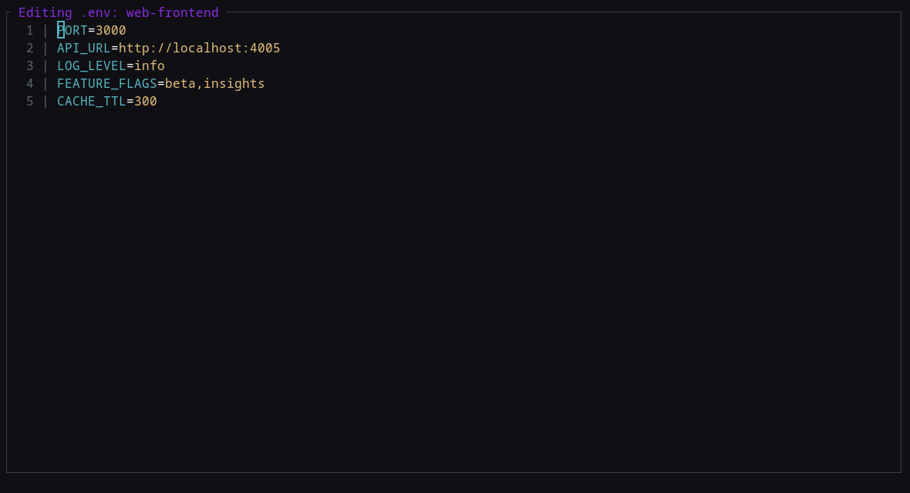

# Matrix 🌌

**Matrix** is a high-performance, keyboard-driven development engine and Terminal User Interface (TUI). It acts as a central orchestrator for managing complex microservice architectures, websites, and platforms during development.

Built with **Rust** and **Ratatui**, Matrix provides a seamless, keyboard-centric workflow for developers who need to manage multiple processes simultaneously with real-time feedback — including a background log-processing thread so log views stay smooth under heavy output.



### In action

| Projects (groups, live status) | Dashboard (system + services) |
|---|---|
|  |  |

| Logs (streaming, sources sidebar) | Command palette |
|---|---|
|  |  |

| Detect projects (language grouping) | Env editor |
|---|---|
|  |  |

---

## ✨ Features

### 🚀 Process Management
- **One-Click Execution**: Start, stop, and restart projects instantly with `Enter` or `r`.
- **Group Actions**: Toggle entire groups (e.g. `Websites`, `Platforms`) with `Enter` on a group header; `r` restarts a whole group.
- **Dependency Ordering**: Projects declare `deps` and start in order — backends (auto-registered `engine:<id>` processes) start before and stop with their parent.
- **Port Conflict Detection**: Prevents multiple services from clashing on the same port, with auto-assigned fallback ports.
- **Graceful Shutdown**: Processes get SIGINT, a 1-second grace period, then SIGKILL only if needed — children are reaped, no zombies, no orphaned processes.
- **In-Place Editing**: Press `p` to edit a project's port or `c` to change its category directly in the list.

### 🔎 Project Detection
- **Detect Modal** (`d`): Scans your home directory for runnable projects (pnpm/npm/yarn workspaces, Cargo crates, Python/Go apps) and lets you add them to Matrix in one keystroke. Monorepo roots, library folders (`packages/`, `plugin-*`, `ui`, `shared`), and version snapshots (`v1`/`v2`…) are filtered out so only live leaf apps surface.
- **Smart Sorting**: Results are grouped by language by default; press `o` to switch to name order.
- **No Duplicates**: Projects already in Matrix are filtered out automatically.

### 📜 Intelligent Logging
- **Isolated Sources**: Each project's logs are grouped and viewable independently, with a sidebar of running sources.
- **Smooth Streaming**: A dedicated background thread processes incoming log lines; new rows append at the bottom without flicker or a "Processing logs…" flash.
- **Word Wrapping & URL Detection**: Lines are wrapped to your terminal width; URLs are highlighted and clickable.
- **Mouse & Clipboard**: Click and drag to select; press `c` in the Logs tab to copy the selection.
- **ANSI Cleaning**: Raw ANSI escape codes are stripped for a clean, glitch-free view.
- **Host Mode** (`h`): Make the selected process listen on all interfaces (adds Vite's `--host`), for testing from other devices.
- **Dev/Prod Mode** (`p`): Toggle between dev and production command for the selected process.
- **Quick Actions**: `r` restarts the selected source, `o` opens the first URL on the selected line.

### ⌨️ Command Mode & Palette
- **Command Palette** (`:`): A responsive, centered modal with ghost-template syntax hints (e.g. `project <id> <path> <command>`) and live filtering as you type.
- **Autocompletion**: Project IDs and template names autocomplete with `Tab`/arrows; path suggestions assist when adding projects or changing directories.
- **Flag-Based Commands**: Consolidated commands keep the surface small — e.g. `project -d <id>` to delete, `template -n <name>` to create, `template -a <template> <id>` to attach.
- **Safety**: Global shortcuts are disabled while typing to prevent accidental tab switches or quits.

### 🌐 Environment Editor
- **Live `.env` Editing** (`env <project_id>`): Open an interactive editor for a project's environment variables without leaving the TUI. Save with `Ctrl+S`.

### 🖥 Dashboard
- **Live Overview**: CPU/RAM meters, running-service counts, and per-service online status at a glance.

---

## 🛠 Architecture

Matrix follows a strict **Feature-Based MVC (Model-View-Controller)** design pattern for maximum maintainability:

- **Shared Engine**: Core logic for process spawning, log capture, and config persistence (`src/engine/`).
- **Modular Features**: Each view (`Dashboard`, `Projects`, `Logs`, `Env`) is its own self-contained MVC module in `src/features/`.
- **App Orchestrator**: A clean, modularized orchestrator in `src/app/` that routes events, owns global UI state, and renders the command palette / detect modal.
- **Background Log Processor**: A dedicated thread (`src/features/logs/processor.rs`) coalesces bursts of incoming log lines and recomputes wrapped/ANSI-cleaned output off the render path, keeping the UI responsive.

---

## 🚀 Getting Started

### Prerequisites
- [Rust](https://www.rust-lang.org/tools/install) (latest stable) — only needed if building from source
- A terminal with mouse support (recommended)

### Install / Update (recommended)

Matrix ships with an idempotent install script that pulls the latest release binary (or builds from source if none is published for your platform):

```bash
curl -fsSL https://github.com/ItzJoris03/matrix/releases/latest/download/install.sh | bash
```

Re-run the same command any time to update to the latest release. The binary lands in `~/.local/bin/matrix` (make sure that is on your `PATH`).

Once installed, Matrix can also update itself:

```bash
matrix update          # download and replace the binary with the latest release
```

`matrix update` checks the latest GitHub release and swaps the running executable in place (atomic replace; restart Matrix after it runs). The repository is public, so no token is needed.

To remove Matrix:

```bash
matrix uninstall
```

`matrix uninstall` asks a clear question: `1` removes Matrix **and** your
configuration (`~/.matrix/` — projects, groups, templates), `2` removes only
the binary and keeps the config. Quit any running instance first.

Options:
- `--debug` — build from source in debug mode (fast compile, unoptimized).
- `--source` — always build from source in release mode.

### Build from source

```bash
git clone https://github.com/ItzJoris03/matrix.git
cd matrix
cargo build --release
./target/release/matrix
```

### Run

```bash
matrix            # if installed via the script
# or
cargo run         # from the repo
```

---

## 🖥 The Interface

### Layout

Matrix fills your terminal with four zones:

- **Header** (top) — brand + version, live CPU/RAM meters, running process count, and the current view name.
- **Sidebar** (left) — the three views: Dashboard, Projects, Logs. Toggle it with `s`.
- **Content** (center) — the active view.
- **Footer** (bottom) — context-aware key hints for the current view.

Transient **toasts** (small notifications, e.g. "project added") appear bottom-right and expire after a few seconds. When an update is available, an **update card** appears there too (see below).

### Switching views

`←` / `→` (or `l` for next) cycle Dashboard → Projects → Logs, wrapping around. Matrix starts on Projects. The sidebar highlights the active view.

---

## 📊 Dashboard

A live resource overview:

- **System meters** — CPU and memory usage (refreshed every 2 seconds).
- **Services table** — every configured project and backend, grouped by category, with its current status (Running / Stopped / Crashed) and port.
- **Running count** — how many services are up, shown in the header.

Keys: `j`/`↓` and `k`/`↑` scroll the table.

---

## 📁 Projects

The heart of Matrix: your project list with start/stop control.

### The list

Items are grouped:

1. **Groups** (expandable headers, e.g. "Websites") containing their projects and auto-provisioned `engine:<id>` backends.
2. **Infrastructure projects** — shared services used by groups.
3. **Standalone projects** — everything not in a group.

Each project row shows its name, category, port, and status. Status is live: **Running**, **Stopped**, or **Crashed** (with the exit error).

### Controlling processes

| Key | Action |
|-----|--------|
| `Enter` | On a project: start it (if stopped) or stop it (if running). On a group: start the whole group or stop it. |
| `r` | Restart the selected project or group (stop, then start). |
| `e` | Expand / collapse the selected group. |
| `p` | Edit the selected project's port inline. |
| `c` | Edit the selected project's category inline. |
| `j`/`↓`, `k`/`↑` | Move the selection. |

### Inline editing

- **Port** (`p`): type digits (max 5), `Backspace` to delete, `x`/`Delete` clears the field. `Enter` confirms and saves; `Esc` cancels.
- **Category** (`c`): type the new category name. `Enter` confirms and saves; `Esc` cancels.

Starting a project resolves its dependencies first (in order), allocates a free port, injects its environment, and spawns it in its own process group. Stopping sends SIGINT, waits a moment, then SIGKILL if needed — backends are stopped before their parent.

---

## 📜 Logs

Live streaming logs for every running source.

### Sources sidebar

The left column lists log sources grouped by category: each running project and backend. `j`/`↓` and `k`/`↑` move between sources (skipping category headers); `PageDown`/`PageUp` jump five at a time. Switching sources clears the current selection and resets scroll.

### The log view

Lines stream in at the bottom, word-wrapped to your terminal width. ANSI colors are preserved where safe and escape sequences are stripped. URLs are highlighted in bright blue.

### Selection & clipboard

- **Mouse**: click on a line to select it; click and drag to select a range. A selection highlights the chosen lines.
- **`c`**: copy the current selection to the clipboard (uses `xclip`/`xsel`-style helpers; a toast tells you if copying failed).
- **`o`**: open the first URL found on the selected line in your default browser. Clicking a URL also opens it.

### Per-source actions

| Key | Action |
|-----|--------|
| `r` | Restart the selected source. |
| `h` | Toggle **host mode** for the selected source (restarts the process with `--host` so it listens on all interfaces — needed for testing from other devices on your network). |
| `p` | Toggle **dev/prod mode** for the selected source (swaps the run command and restarts). |

The badge next to the source name shows the current mode: `[DEV]` or `[PROD]`, plus a host-mode indicator.

### Why it stays smooth

Log lines are processed on a dedicated background thread: word wrapping and URL detection are cached per project/width and reused across frames, bursts of new lines are coalesced into a single recompute, and while the worker catches up you keep seeing the previous frame's rendered lines — no flash, no stutter, even under heavy output.

---

## 🌐 Environment Editor

Opened with `env <project_id>` from command mode. A lightweight full-screen editor for the project's `.env` file, with simple syntax highlighting.

| Key | Action |
|-----|--------|
| `Esc` | Exit back to the previous view. |
| `Ctrl+S` | Save the file to disk. |
| Arrow keys | Move the cursor. |
| `Enter` | Insert a newline. |
| `Backspace` | Delete the previous character. |
| Any other key | Insert that character. |

---

## ⌨️ Command Mode (`:`)

Press `:` to open the command palette. As you type, commands are filtered by prefix and a usage hint is shown for each (`project <id> <abs_path> <command>`…).

| Key | Action |
|-----|--------|
| Type | Filter commands / type arguments. |
| `Tab` | Complete the highlighted command, or accept the current path suggestion. |
| `↑` / `↓` | Move through suggestions. |
| `Ctrl+Backspace` | Delete the previous word. |
| `Enter` | Execute the command (or accept a suggestion). |
| `Esc` | Close the palette (or clear suggestions first). |

### Command reference

| Command | Description |
|---------|-------------|
| `project <id> <abs_path> <command>` | Add a project. |
| `project -d <id>` | Delete a project. |
| `template <name>` | Run a template (start its projects). |
| `template -n <name>` | Create a new (empty) template. |
| `template -a <template> <id>` | Attach a project to a template. |
| `template -d <name>` | Delete a template. |
| `group <start\|stop> <group_id>` | Start or stop a group. |
| `start <project_id>` / `stop <project_id>` / `restart <project_id>` | Control a single project. |
| `status` | Print the running-service status. |
| `cd <path>` | Change Matrix's working directory. |
| `env <project_id>` | Open the environment editor for a project. |
| `open <url>` | Open a URL in the default browser. |
| `detect` | Open the Detect-Projects modal. |

Path suggestions appear automatically for arguments that take paths (`project <path>`, `cd <path>`) and complete with `Tab`.

---

## 🔎 Detect-Projects Modal

Press `d` to scan for projects on disk that aren't in Matrix yet. Matrix walks your home directory (depth-capped), expands workspace manifests (npm/pnpm/yarn), and prunes noise: dependencies, library folders, SDK roots, and old version snapshots. Only live leaf apps surface.

The modal shows each candidate's **name, language/category, and path**, grouped by language by default.

| Key | Action |
|-----|--------|
| `j`/`↓`, `k`/`↑` | Navigate the list. |
| `Enter` | Add the selected project to Matrix (saves config immediately). |
| `o` | Toggle sort: by language ↔ by name. |
| `Esc` | Close the modal. |

Added projects get their detected id, path, and run command; you can adjust port/category afterwards in the Projects view.

---

## 🔔 Update Card

When a newer release exists on GitHub, a small card appears bottom-right on startup:

| Key | Action |
|-----|--------|
| `c` | Open the release/changelog page in your browser (card stays visible). |
| `u` | Run the self-update now (in the background; the result arrives as a toast). |
| `Esc` | Dismiss the card. |

`Enter` deliberately does nothing — the card never hijacks the universal confirm key.

---

## ⚙️ Configuration

Matrix keeps **one config file per device**: `~/.matrix/matrix.json` (i.e. `$HOME/.matrix/matrix.json`). It is read no matter which directory you launch `matrix` from — the tool is not configured per-folder.

- The file is created automatically (in `~/.matrix/`) the first time you save, e.g. after adding a project with `:project`.
- **Relative paths in the config resolve against the config file's directory** (`~/.matrix/`), not the launch directory — use absolute paths for anything that lives elsewhere.
- You can add projects manually or via the `:project` command.

```json
{
  "projects": [
    {
      "id": "my-service",
      "path": "/path/to/project",
      "command": "npm run dev",
      "port": 3000,
      "category": "platforms"
    }
  ],
  "templates": [],
  "groups": []
}
```

### Project fields

| Field | Type | Description |
|-------|------|-------------|
| `id` | string | Unique id used everywhere (commands, deps, socket). |
| `name` | string | Optional display name (defaults to the folder name). |
| `path` | string | Working directory for the process. |
| `command` | string | Command to run (e.g. `npm run dev`). |
| `port` | number | Fixed port; if unset, Matrix picks one. |
| `category` | string | Grouping label shown in the UI. |
| `env_only` | bool | Project exists only to define environment (no process). |
| `deps` | string[] | Project ids started before this one, in order. |
| `backend` | object | Auto-registers a virtual `engine:<id>` process that starts before and stops with the project. |
| `env` | array | Environment variable specs (see below). |

### Backend fields

| Field | Type | Description |
|-------|------|-------------|
| `path` | string | Backend working directory. |
| `command` | string | Command to run (optional). |
| `port` | number | Fixed backend port; if unset, resolves to parent port + 1. |
| `deps` | string[] | Backend dependencies. |
| `env` | array | Backend env specs — placeholders resolve against the **parent** project. |
| `category` | string | Backend category. |

### Env spec fields

| Field | Type | Description |
|-------|------|-------------|
| `key` | string | Variable name. |
| `value` | string | Literal value. |
| `file` | string[] | `.env`-style files to read the key from, in order; first match wins. |
| `default` | string | Templated fallback when neither `value` nor any `file` provides the key. |
| `if_running` | string | Project id — when it is running, `value` is used; otherwise `else_value` (if present) is used. |
| `else_value` | string | Used instead of `value` while `if_running`'s project is **not** running. |

`PORT` and `ENGINE_PORT` are always injected in addition to the specs.

### Templates

A `Template` is a named list of project ids:

```json
{ "name": "frontend-stack", "projects": ["web", "api"] }
```

`template -a frontend-stack web` attaches a project; `template frontend-stack` runs the whole stack.

### Groups

A `Group` is a named set of projects started/stopped together:

```json
{ "id": "sites", "name": "Websites", "projects": ["shop", "blog"], "infrastructure": [] }
```

`infrastructure` lists shared services that start alongside the group (for example a database) — a group counts as "running" when its **own** projects are up, independent of shared infrastructure.

### Env templating

Env values and defaults support placeholders, written as `{{` name `}}`:

| Placeholder | Resolves to |
|-------------|-------------|
| `{{id}}` | Project id. |
| `{{path}}` | Project path. |
| `{{port}}` | Project port. |
| `{{parent_port}}` | Parent project's port (pipe = fallback, e.g. `{{parent_port\|3000}}`). |
| `{{backend_port}}` | Backend port. |
| `{{dbname}}` / `{{dbname_upper}}` | Database name, lower / UPPER. |
| `{{env:KEY}}` | An earlier entry in the same env list. |
| `{{port+5}}` | Port offset arithmetic. |

Unknown placeholders stay literal — a typo never silently becomes an empty string.

---

## 🔌 External Control (CLI & socket)

Matrix listens on a Unix socket (`/tmp/matrix-control.sock`) and accepts commands so other tooling can drive it headlessly:

```bash
matrix status               # print running-service status
matrix start <project_id>
matrix stop <project_id>
matrix restart <project_id>
matrix group start <group_id>
matrix group stop <group_id>
matrix projects             # list projects
matrix groups               # list groups
```

Any argument passed on the CLI is sent to the running instance over the socket; the response is printed. `matrix update` and `matrix uninstall` are handled directly (they don't need a running instance).

---

## 🛠 Troubleshooting

- **Clipboard copy fails** — Matrix needs a clipboard helper (`xclip`, `xsel`, etc.); the toast tells you if one is missing.
- **Host mode doesn't reach other devices** — the process must be restarted after toggling (Matrix does this automatically) and your firewall must allow the port.
- **"Matrix is already running"** — only one TUI instance per machine; control the running one via the CLI/socket.
- **Logs seem stuck** — the background processor coalesces bursts; heavy output catches up within a frame or two. If it ever feels broken, report it — that path is the most delicate in the app.

---

## 📦 Release

Tagged releases (`vYYYY.MM.DD.<revision>`) are published on GitHub. Each release attaches a prebuilt binary for common platforms; the install script prefers the binary and falls back to a source build when unavailable.

---

## ⚖️ License

[](https://www.gnu.org/licenses/gpl-3.0)

Matrix is free software, licensed under the [GNU General Public License v3.0 or later](LICENSE).

You are free to use, modify, and redistribute it — but any distributed version must remain free and open under the GPL. That's the deal: forks flow back, nobody can close Matrix off.

---

*Matrix - Logic-Driven Development.*
